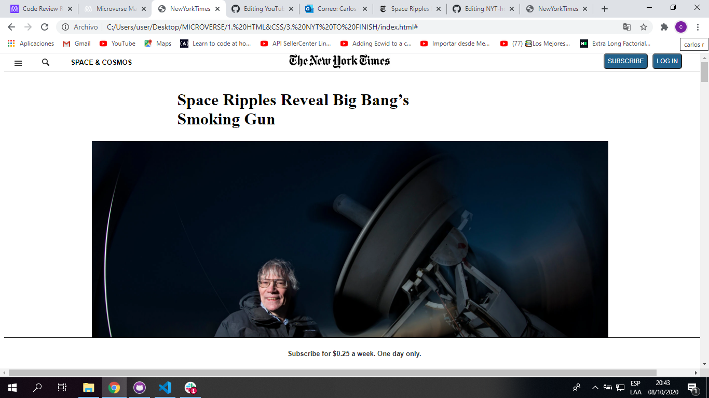

# NYT-homepage- Microverse Project

This is a clone of the New York Times original web page. It is a project to show the implementation of HTML and CSS positioning. It is done as part of the microverse program for the third project of the curriculum.

## Built With

- HTML & CSS
- Visual Studio, Git & GitHub

## Live Demo

[Live Demo Link](https://shahnaeem.github.io/NYT-homepage/)

## Getting Started

Just download the code in your local machine and go to the dowloaded folder, search for the index.html file and open it in your favourite browser.

### Prerequisites
To run this project, you need a computer or a mobile devise with any operating system and a web browser.
### Setup
Just download the code.
### Install
Go to he downloaded folder and search for index.html file and open it in your favorite web browser.
### Usage
This projects diplays the videos.

## Authors

👨🏻‍💻 **Carlos Albenio Gutierrez Monroy**
- GitHub: [@cgcarlosg](https://github.com/cgcarlosg)
- Twitter: [@cgcarlosg1](https://twitter.com/cgcarlosg1)
- LinkedIn: [@carlosalbeniogutierrez](www.linkedin.com/in/carlosalbeniogutierrez)

👨🏻‍💻 **Mohd Nayeem Shah**
- GitHub: [@shahnaeem](https://github.com/shahnaeem)
- Twitter: [@mohdnayeemshah1](https://twitter.com/MOHDNAYEEMSHAH1)
- LinkedIn: [@mohd-nayeem-shah-97a590152](https://linkedin.com/in/mohd-nayeem-shah-97a590152)

## 🤝 Contributing

Contributions, issues, and feature requests are welcome!

Feel free to check the [issues page](https://github.com/shahnaeem/NYT-homepage/issues).

## Show your support

Give a ⭐️ if you like this project!

## Acknowledgments

- To carry out this project we used Microverse Study material, W3 Schools and Google.

## 📝 License

This project is [MIT](license.md/) licensed.
